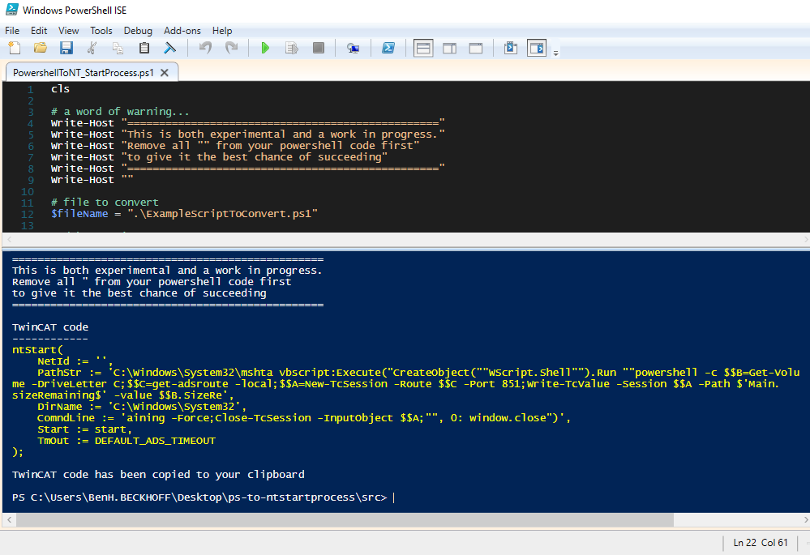

# A small utility script for converting PowerShell scripts to NT_StartProcess

## Disclaimer
This is a personal guide not a peer reviewed journal or a sponsored publication. We make
no representations as to accuracy, completeness, correctness, suitability, or validity of any
information and will not be liable for any errors, omissions, or delays in this information or any
losses injuries, or damages arising from its display or use. All information is provided on an as
is basis. It is the reader’s responsibility to verify their own facts.

The views and opinions expressed in this guide are those of the authors and do not
necessarily reflect the official policy or position of any other agency, organization, employer or
company. Assumptions made in the analysis are not reflective of the position of any entity
other than the author(s) and, since we are critically thinking human beings, these views are
always subject to change, revision, and rethinking at any time. Please do not hold us to them
in perpetuity.

## WARNING
This is a utility script which is a work in progress.  This may not produce usable code.  Please check all code which is produced before running it on a live environment. 

## Overview 
Quite often you will see me post solutions which use NT_StartProcess as a mechanism for holding and running powershell scripts without any external files.  This is the tool I wrote to help with that process.  

This is only a helper, and quite often I will need to create a TwinCAT safe powershell script first before running it through this.  

Things to be aware of
* Using double quotes in your powershell should be avoided.  These generated a large resulting string due to escaping and this is not fully supported.  Best to use single quotes and [char]34.  
* Just because it works in powershell does not mean it will work in TwinCAT.  Due to the lack of debugging support you may never find the reason for the code simply not working as expected.

## Getting Started
Open PowershellToNT_StartProcess.ps1 and change the $fileName to your powershell script (or use the example provided).  Run the script and see the resulting code.  This will also be copied to clipboard.

## Screenshot

## Need more help?
Please visit http://beckhoff.com/ for further guides

## Stay updated
Please follow [me](www.linkedin.com/in/benhardev) and [Beckhoff Australia](https://www.linkedin.com/company/beckhoff-automation-aus/) to stay updated.
